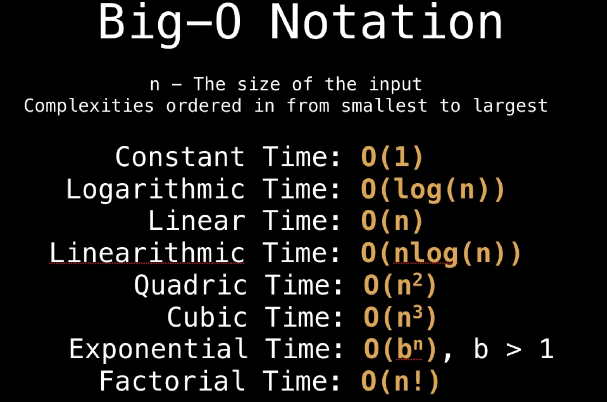

- input size matters
- actual time doesn't matter
- how time or space taken by an algorithm increases with the arbitarily big vinput size

## Big O notation
- upper bound (worst case scenario)

## Omega notation Omega 3 is the best
- lower bound (best case scenairo)

## Theta notation
- average, provides both an upper and lower bound on the growth

**Notes: In some cases, asymptotically slower alogrithms may perform better in lower input size**

