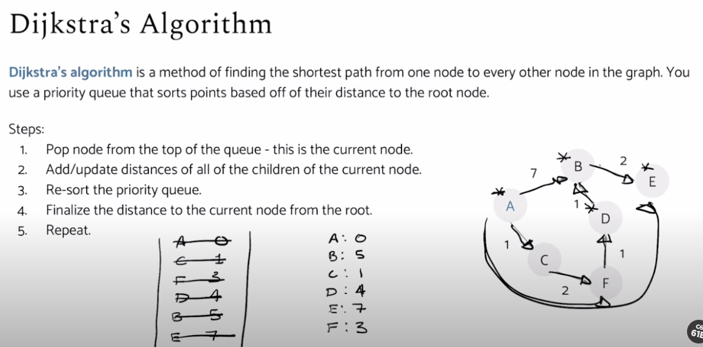

# Dijkstra's Algorithm (SSSP) :anguished:

Dijkstra’s is guaranteed to return a correct result if all edges are non-negative. 

BFS doesn't work if the edges are not equally weight.

Single Source Shortest Path


#### O(E * log(V))

- does not work with negative edges
- based on **Best First Search**

# Runtime Analysis

- add to Priority Queue `V * O(logV)`
- removeSmallest from PQ `V * O(logV)`
- changePriority in PQ `E * O(logV)`

- Overall Runtime = `O(V*logV + V*logV + E*logV)`

- can be reduced to `O(E*logV)` *assuming E >> V*
(much more edges than the nodes)

> Shortest Path depends mostly on the number of edges + Log(number of nodes). 

### Key Invariants
1. edgeTo[v] is the best known predecessor of v
2. distTo[v] is the best known total distance from source to v
3. PQ contains all unvisited vertices in order of distTo
4. Always visits vertices in order of total distance from source
5. Relaxation ==always== failed on edges of visted vertices.


### Pseudocode
```java
function dijkstra(g, n, s):
    vis = [false, false, ...]
    prev = [null, null, ...]
    distTo = [inf, inf, inf, ...] 
    distTo[s] = 0
    PQ = empty priority queue
    PQ.insert((s, dist[s]))
    while PQ not empty:
        index, minValue = PQ.poll()
        vis[index] = true
        for (edge : g[index]):
            if vis[edge.to]: continue
            newDist = distTo[index] + edge.cost
            if newDist < distTo[edge.to]:
                distTo[edge.to] = newDist
                prev[edge.to] = index
                PQ.changePriority((edge.to, newDist)) 
    return distTo, prev


// e = end node
function findShortestPath(g, n, s, e):
    dist, prev = dijkstra(g, n, s)
    path = [] 
    if (dist[e] == inf): return path
    while e != null:
        path.add(e)
        e = prev[e]
    path.reverse()
    return path
```


## Procedure for Exam Taking


### 1. Dijkstra's Algorithm
1. Make a Priority Queue with `Node | Length to Node from Start`
2. Another List that tracks the `final distance` of Node from Start
* After removing from Priority Queue -> the `final distance` will be final, no more further operations can change the distance. (<sub><sup>this is due to Dijkstra's property: i.e; relaxation **always** fails on visisted nodes</sup></sub>)
* Don't forget that the distance in PQ should be total distance from Start to "that" node. (*not just one single edge weight*)



### 2. A* Algorithm
1. Make a Priority Queue with `Node | Length to Node from Start + Heuristic of that* Node`
2. Another List that tracks the `final actual distance` of Node from start `without heuristic`
> :bulb: **Important:**
<sub><sup> 1. Have similar properities with Dijkstra's but weighted towards the goal using a **Good** heuristic.</sub></sup>
<sub><sup>2. If the algorithm has **Bad** heuristic, it will never reach the goal / result in a *not* shortest path.</sub></sup>
