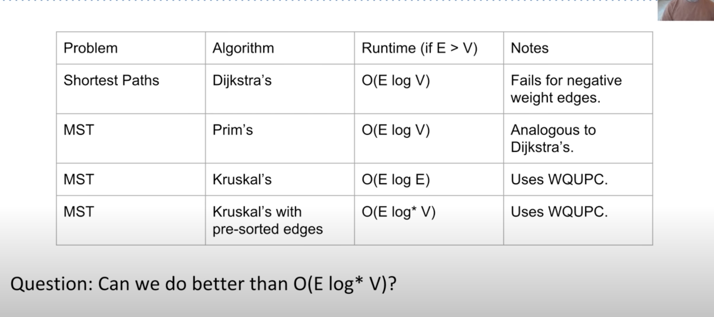

# Minimum Spanning Tree

- a Tree within a graph that connects all the nodes in the ==undirected== graph
- with the lightest total edge weight
- MSTs may not be unique ==if== there are multiple edges of the same weight

MST algorithms
: 1. Prim's Algorithm
  2. Kruskal Algorithm

### Prim's Algorithm (node based) (O E*log(V))

- start with any node
- add that node to MOST set
- while there are still nodes not in the MST:
    Add the ==lightest edge== that leads to a node that is unvisited.
    Add the new node to the set of nodes in the MST.

### Kruskal's Algorithm (edge based) (O E*log(E))

- while there are still nodes not in the MST:
    Add the ==lightest edge== that doesn't create a **loop**.
    Add the new node to the set of nodes in the MST.

#### Notes

- Prim's and Krukal's will return the **same size MST**
- but will not return the **same MST**
- if there's only one MST, both may return the exact MST

--- 
### Prim's Implementation
* MST implementation solely depends on detecting cycles
* Implementation uses PQ
* Priority Queue helps with runtime a little bit
* Prim's and Dijkstra's are almost the same
* difference between Prim's and Dijkstra's PQs is Dijkstra is `distance from the source` and Prim is `distance from the tree`
* Prim simply wants the shortest edge

### Kruskal's Implementation
* consider edges in order of increasing weight
* Add to MST unless a *cycle* is created
* Repeat until V-1 Edges

1. PQ with all edges in descending order
2. WQU to track the nodes in MST
    * if it creates cycle -> skip
    * if not, connect it in WQU
3. MST List that tracks all nodes in MST

#### Runtime:

* Elog(E)
* if the edges are pre-sorted, E*log\*(V)

#### Detecting Cycles
1. Using DFS, cycle if dfs revisit the node that is not its parent `O(V+E)`
2. Using weightedQuickUnion `O(V + Elog*V)`

