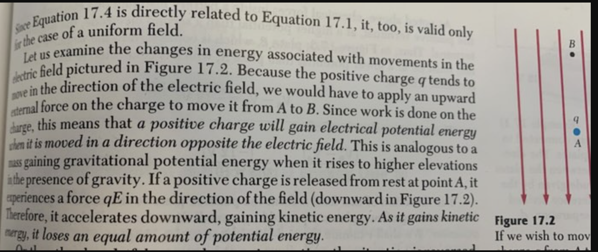

# Electric Potential on a Charge

1. Think of Electric Field as a waterfall, where water is falling from the top of the page to bottom of the page. 

2. A and B are the **points** located on the waterfall. These are just locations

3. Since the charge `q` is postive, the waterfall (electric field) will push it downward.

4. In order for the charge `q` to go upward (against the waterfall) / stationary, `external force` must be applied. 

5. External force on `q` = giving `q` energy from outside of the system.

6. Therefore `potential energy of q` will increase.

**Scenario 2**

1. Assume there is no external force on `q`.

2. `q` will fall down until it touches the bottom of the page (because of the waterfall).

3. Since it goes down, the potential energy of `q` will decrease accordingly. (you can also think of this as, some part of potential energy of `q` is consumed by moving down)  similar to engines burining gasoline to move its phsyical parts

> :bulb: Tips
    * Think of Electric field as a waterfall
    * `q` cannot fly. In order to make `q` fly at a certain point (x or y), there must be some sort of thrust from the bottom.
    * The higher you can resist the waterfall, the higher the electric potential energy of `q`
    * If you can't resist anymore and fall down, `q` electric potential will decrease.
    * Think about rockets. In order to make the rocket fly or (even stationary) in air, there must be some sort of thrust (and this will burn the energy resources). Thrust = external force in this context.