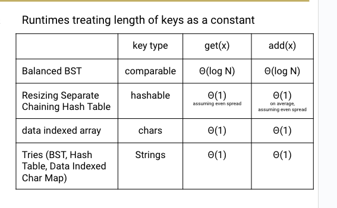

# Tries

* Store each letter of the string as a node in the tree
* Nodes can be shared by multiple keys

> Inner Data Structures:
    1. DataIndexedCharMap: Very fast, but memory hungry.
    2. Hash Table: Almost as fast, uses less memory.
    3. Balanced BST: A little slower than Hash Table, uses similar amount of memory?

## Runtime

* Add `Theta(1)`
* Contains `Theta(1)`
    OR if L = length of the key
* Add `Theta(L)`
* contains `Big O(L)` can fall off the tree, thus big O(L)

**Optimal implementation of Autocomplete involves use of a priority queue!**

Radix Tree = merge nodes that are `redundunt`