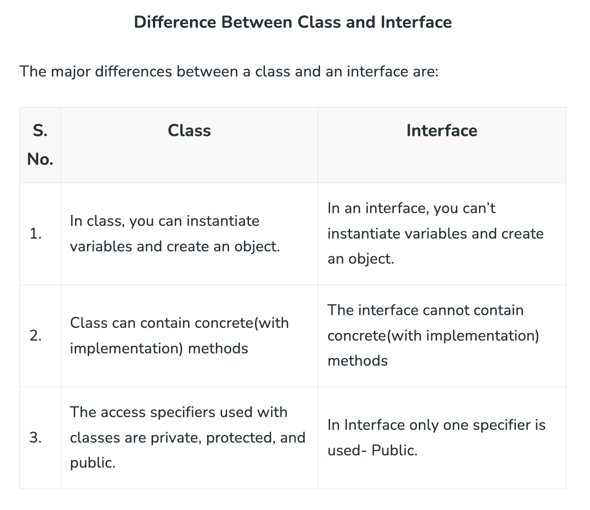

# Interface

- implicitly `public static final`
- does not have a constructor
- the class implmenting the `interface` must implement all methods in the interface.
- does not need to implement, if the method inside interface is default
- can be static types (on the left)
- can be parameter aruguments (polymorphism? this make sure that the input fulfil the interface contract. also this will allow the user to put anyList instead of a specific List)
- 

```java
public interface MyInterface {
    // default methods are implicity public
    // default methods in Java interfaces are not static
    // default methods are designed to be called on instances of classes that implement interface, not on the interface itself.
    // it can still be @Overriden
    // default methods are not inherited
    default void defaultMethod() {

    }
}
```
