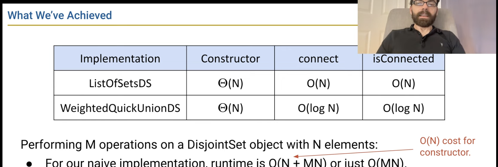

# Disjoint Set Recap


```java
// sizes are denoted with negative numbers
// initially, all nodes have -1 as data (individual disjoint sets)
// if parent[v] = -ve, v = parent of itself, and size = parent[v]
public void connect(int v1, int v2)      // can be also union
public boolean isConnected(int v1, int v2) {
    return find(v1) == find(v2) || v1 = find(v2) || v2 = find(v1)
}

public sizeOf(int v) {
    // return the size of v's parent
    int root = find(v);
    return -data[root];
}
public parent(int v) // return parent[v]

public int find(int v) {
    // find the root of the set/tree v
    int val = find(data[vd])
}
```


<br>


## Disjoints

- connect(x, y)
- isConnected(x, y)


Examples:
- connect(Russia, China)
- connect(Russia, Mongolia)
- isConnect(Russia, China)  // transitive connections


Kruskal's alogrithm


### to keep thinks simple
- force all items to be integers
- declare the number of items in advance 
- everything is disconnected at first

```java
ds = DisjointSets(7)
```

### Approach -> Connected Components

{0}, {1}, {2}, {3}, {4}
{0, 1}, {2}, {3}, {4}


> Two sets are called disjoint sets if they don’t have any element in common, the intersection of sets is a null set.


ss


in fastUnion, (NOT GOOD)
-> worst case "is connnected" -> Theta(N)
-> worst case "Connect" -> Theta(N)? 
<hr>

Short and Fat Tree -> bettter for fastFind, fastUnion
- problem with fastUnion, the tress can be tall. 
- solution? weighted or path compression


- amount of time to find the root -> faster

### Important
- join the shorter tree to the longer parent? 
- (link up shorter tree under longer tree)
- in other words, change the parent of longer tree


### weight vs height (WHY?)

- weight = number of childs


<hr>
<br>
# Reviews (Geeks on Geeks)


for lab

- smallest element is the root
- the root value is gonna be -weight
- for child, the root is the parent index
- initially, the root is -1
- weight = weight -> smaller value is the root
- union(node, node)
- find the node parent first
- get the weight of the parent
- join the smaller tree under bigger tree (right)
    - bigger tree index += smaller tree content
    - smaller tree parent node = bigger tree index




