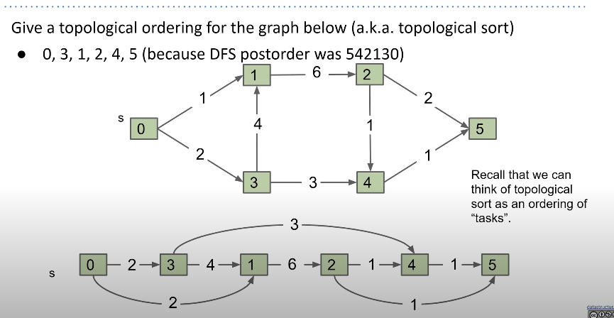
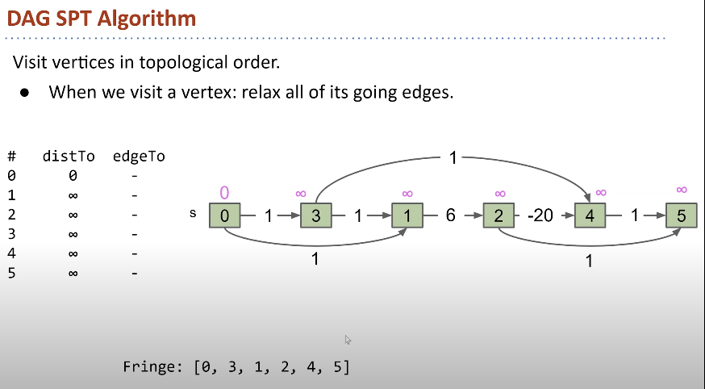

# Directed Acyclic Graph

* No cycles
* Directed Graph
* Useful for finding topological sorting
* Runtime **O(V + E)**
* Shortest Path Tree in DAG **allows negative** edges
---
> How to find topological sort
    1. run DFS postorder at a node, reverse the output list
    2. Runtime `O(V + E)`

Notes:
* There will be no topological sort if the graph is not directed / has cycles.s

## Shortest Path in DAG
* No Priority Queue
* The fringe is already built using topological sort.
* The node should be visited in topological order.

