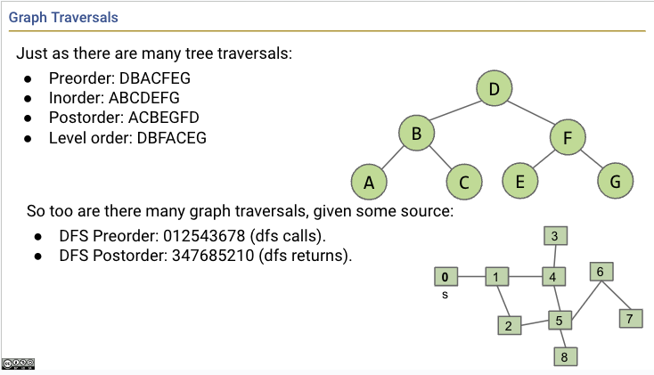
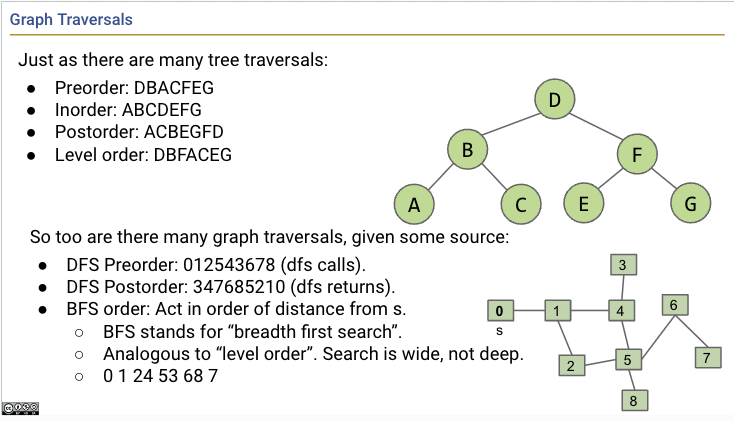
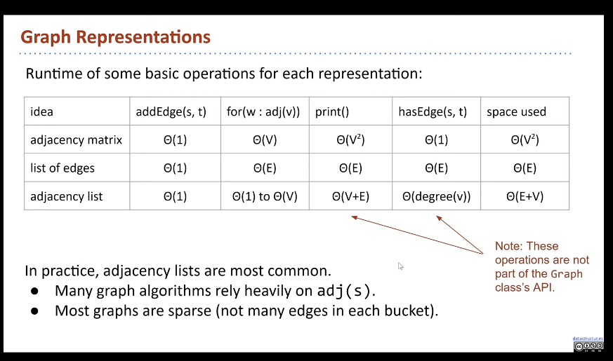
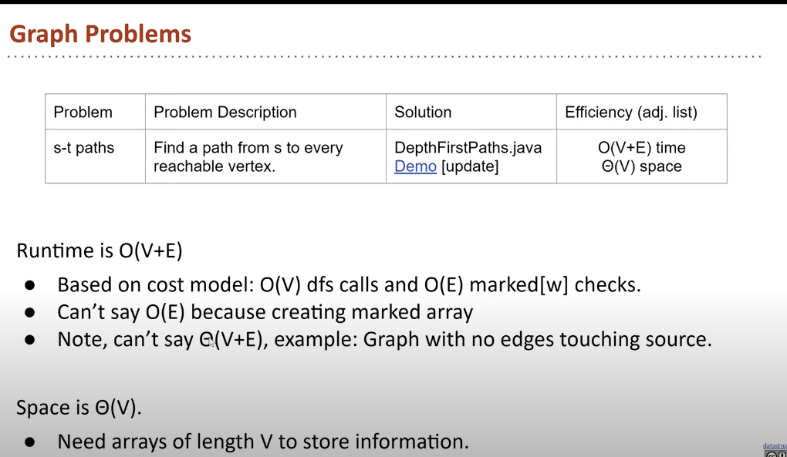
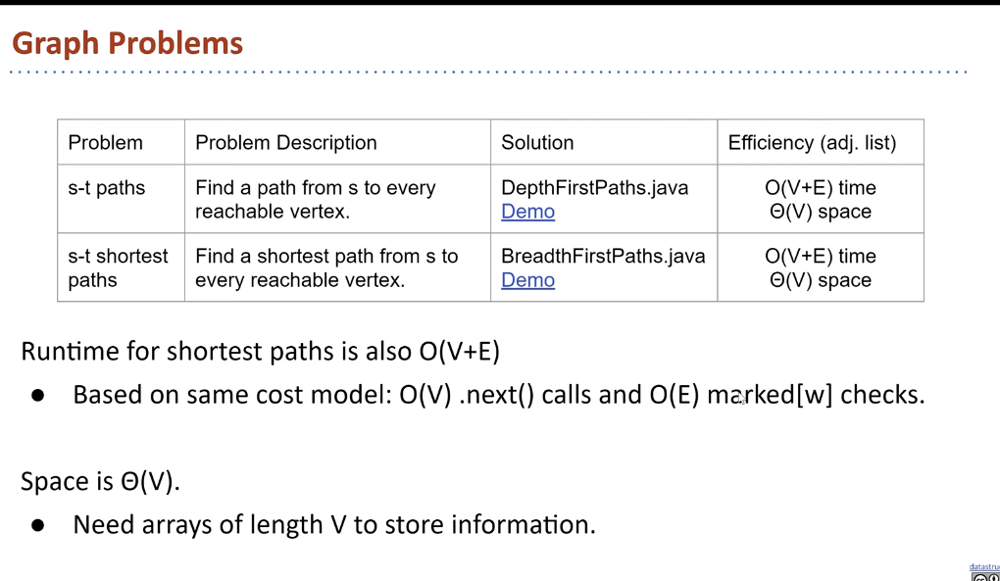

# Graphs


### S-T Connectivity (Recursion)

- is there a path between vertices S and T?

```java
connected(s, t)
    s == t?
    if so, return true

    otherwise 
        mark s (important so that it doesn't loop infintely)
        do connected(v, t) to the neighbors of v of s.
    
    return false
```

### Depth Frist Traversal
- exploring neighbor's entire subgraph before moving on to the next neighbor

### Breadth Frist Search (BFS)
- in order of **Distance** from the start
- uses QUEUE, first in first out

### DFS Preorder:
Action is before DFS calls to Neighbors

### DFS Postorder:
Action is after DFS calls to Neighbors
{post order is like go all the way in like preorder, and then backtrack}





<hr>


BFS Implementation
- Initialize the fringe (a queue with a starting vertex s) and mark that vertex

- Repeat until fringe is empty: 
    - remove vertex v from fringe (exploring stage?)
    - for each unmarked neighbor n of v: 
        - mark n
        - add n to fring
        - set edgeTo[n] = v
        - set distTo[n] = distTo[v] + 1

In queue, the closest thing is always at the front
At any time, the distance to all items in the queue is either k or k + 1.

> BFS guarantees finding the shortest path in a graph if all the edge weighs are equal and unweighted


# Graph API (Implementation)

```java
public Graph(int V)
public void addEdge(int v, int w)
Iterable<Integer> adj(int v)
int V() // number of vertices
int E() // number of edges


/**
 * degree (number of edges) of vertex v in graph G
 */
public static int degree(Graph G, int v) {
    int degree = 0;
    for (int w: G.adj(v)) {
        degree++;
    }
    return degree;
}

public static void print(Graph G) {
    for (int v = 0; v < G.V(); v++) {
        for (int w : G.adj(v)) {
            System.out.println(v + "-" + w);
        }
    }
}
```

### Graph Representations

1. Ajdacency Matrix (not good for undirected graph, and diagonal always zero if the vertex doesn't loop itself)
    > to print out, it's Theta(V^2); E = total number of edges
    > To Iterate V's neighbors, Theta(V)

2. HashSet<Edge> {(0, 1), (0, 2)} (not really used)

3. Adjacency Lists (real life graphs are sparks)
    > All cases: Theta(V + E); E = total number of edges for the **entire** graph
    > Best Case: Theta(V), Worst Case: Theta(V^2)
    > To Iterate V's neighbors Omega(1), Omega(V)




 ```java
 public Paths(Graph G, int s) .  : find all paths from G
 boolean hasPathTo(int v)        : is there path from s to v
 Iterable<Integer> pathTo(int v) : path from s to v if any
 ```

 
 


(DFS and BFS) DepthFristPaths on Adjacency List O(V + E)
(DFS and BFS) DepthFristPaths on Adjacency Matrix O(V^2)
