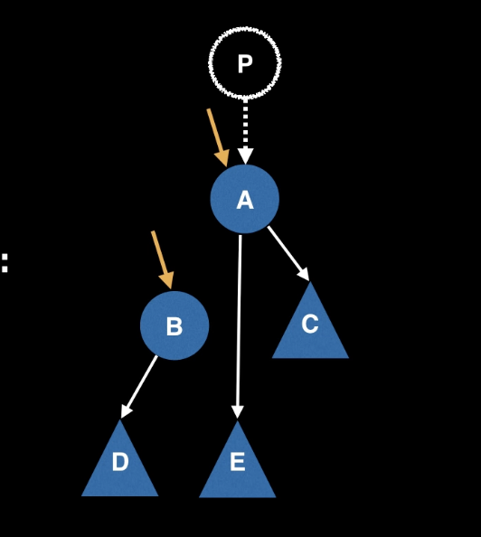

# Left Leaning Red Black Tree

- one to one with 2-3 Tree
- maintains this by using **Rotation** 

Invariants of Red Black Tree
1. Insertion is always done initially by a red link
2. If insertion causes right leaning, rotate left the appropriate node 
3. If two red left links, rotate right the appropriate node
4. If two children are red, do colorflip
 

H = tree of 2-3 tree
max red-black tree height = 2H + 1


```java
if (isRed(h.right) && !isRed(h.left)) { h = rotateLeft(h); }
if (isRed(h.left) && isRed(h.left.left)) { h = rotateRight(h); }
if (isRed(h.left) && isRed(h.right)) { flipColors(h); }
```

```java
function rightRotate(A):
    pointer to A and B
    B := A.left
    A.left = B.right
    B.right = A
    return B
```



Properties of Red Black Tree
- Root is Black
- Leaves (NIL) are Black
- The childern of Red node must be Black
- The parent of Red node must be Black
- All leavles have the same black depth (Think about 2-3 Trees)

Insertion in LLRB:
    * Insert like BST
    * Rotate to maintain the invariants